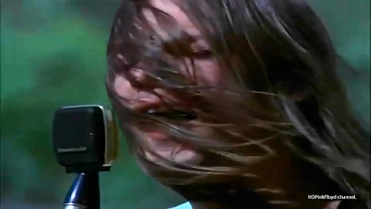

10cc - I'm Not In Love

Aha - Hunting High And Low

Aha - Take On Me

Aha - The Sun Never Shone That Day

Aha - You'll Never Get Over Me

Alan Parsons Project - Old and Wise

Alan Parsons Project - Time

Angus & Julia Stone - Big Jet Plane

Archive - Goodbye

Archive - Headlights

Archive - I Will Fade

Archive - Lights

Archive - Fold

Ben E. King - Stand By Me

Black - Wonderful Life

Bruno Mars - When I Was Your Man

Chris Isaak - Wicked Game

Chubby Checker - Let's Twist Again

Clash - London Calling

Coldplay - Fix You

Coldplay - The Scientist

Coldplay - Yellow

Commodores - I'm Easy (cover, Faith No More)

The Connels - '74 '75

The Cure - A Forest

The Cure - Lullaby

The Cure - Pictures Of You

The Cure - There Is No If

Deep Purple - Child In Time

Deep Purple - Soldier Of Fortune

Deep Purple - Sometimes I Feel Like Screaming

Deep Purple - When A Blind Man Cries

Depeche Mode - In A Manner Of Speaking

Dire Straits - Private Investigations

Dire Straits - Why Worry

The Doors - The End

The Doors - Hello, I Love You

The Doors - Light My Fire

The Doors - Love Her Madly

The Doors - Love Me Two Times

The Doors - People Are Strange

The Doors - Riders On The Storm

Drive - College & Electric Youth - A Real Hero

Drive - Kavinsky - Night Call

Drive - Kavinsky - Under Your Spell

Electric Light Orchestra - Calling America

Electric Light Orchestra - Confusion

Electric Light Orchestra - Here Is The News

Electric Light Orchestra - Last Train To London

Electric Light Orchestra - Rockaria!

Electric Light Orchestra - Strange Magic

Elton John - Your Song

Elvis Presley - Wise Men Say

Garbage - Milk

Gary Jules - Mad World

Gene Kelly - Singin' In The Rain

Gene Kelly - Good Morning

George Harrison - My Sweet Lord

The Human League - Together In Electric Dreams

Inxs - Never Tear Us Apart

Iron Maiden - Como Estais Amigos

Iron Maiden - Don't Look To The Eyes Of A Stranger

Iron Maiden - Strange World

Jason Donovan - Sealed With A Kiss

Jason Mraz - Life Is Wonderful

John Lennon - Imagine

Joy Division - Atmosphere

Joy Division - Disorder

Joy Division - Love Will Tear Us Apart

Joy Division - New Dawn Fades

Joy Division - Shadowplay

Judy Garland - Somewhere Over The Rainbow

Katie Melua - Spider's Web

Ke - Strange World

The Killers - Just Another Girl

The Killers - Mr. Brightside

The Killers - Somebody Told Me

King Crimson - Epitaph

King Crimson - Fallen Angel

King Crimson - Islands

King Crimson - Starless

King Crimson - The Night Watch

Laura Sweden - Release Me

Led Zeppelin - Babe I'm Gonna Leave You

Led Zeppelin - D'yer Mak'er

Led Zeppelin - No Quarter

Led Zeppelin - Since I've Been Loving You

Led Zeppelin - Tea For One

Lenka - Don't Let Me Fall

Lenka - Like A Song

Lenka - Live Like You're Dying

Lenka - The Show

Lenka - Trouble Is A Friend

Leonard Cohen - In My Secret Life

Limahl - Neverending Story

Louis Armstrong - We Have All The Time In The World

Manic Street Preachers - If You Tolerate This Your Children Will Be Next

Maria Mena - All This Time

Maria Mena - Am I Supposed To Apologize

Maria Mena - I'm In Love

Maria Mena - Just Hold Me

Milli Vanilli - Girl I'm Gonna Miss You

Miss Li - All I Need Is You

Miss Li - Dancing The Whole Way Home

Miss Li - I'm Glad I'm Not A Proud American

Miss Li - I'm Sorry He's Mine

Miss Li - Is This The End?

Miss Li - Let Her Go

Miss Li - Oh Boy

MIss Li - A Song About Me And A Boy

Miss Li - Why Don't You Love Me

New Order - Blue Monday

Norah Jones - Come Away With Me

Nouvelle Vague - Fade To Grey

Nouvelle Vague - In A Manner Of Speaking

Nouvelle Vague - Just Can't Get Enough

Nouvelle Vague - Too Drunk To Fuck

Olly Murs - Heart Skips A Beat

Otis Redding - (Sittin' On) The Dock of the Bay

Otis Redding - These Arms Of Mine

Paolo Nutini - These Streets

Parov Stelar - Hurt

Peter Gabriel, Kate Bush - Don't Give Up

Pixies - Where Is My Mind?

Pink Floyd - Bike

Pink Floyd - Echoes

Pink Floyd - Fat Old Sun

Pink Floyd - Fearless

Pink Floyd - The Final Cut

Pink Floyd - High Hopes

Pink Floyd - If

Pink Floyd - Nobody Home

Pink Floyd - A Saucerful of Secrets

Pink Floyd - Time

The Proclaimers - 500 miles

Procol Harum - Whiter Shade Of Pale

Pulp - Common People

Pulp - Disco 2000

Radiohead - Creep

Radiohead - Creep (cover, Carrie Manolakos)

Radiohead - Karma Police

Radiohead - No Surprises

Radiohead - Street Spirit

Ray Charles - All I Ever Need Is You

Ray Charles - For Mamma

Ray Charles - I've Got a Woman

Rick Wright, Sinéad O'Connor - Reaching For The Rail

Robert Plant - Big Log

Robert Plant - Darkness, Darkness

Robert Plant - Sea of Love

Robert Plant - Skip's Song

Robert Plant - Song to the Siren

Roger Waters - Four Minutes

Roger Waters - Home

Roger Waters - Perfect Sense

Roger Waters - The Remains Of Our Love

Roger Waters - Too Much Rope

Roger Waters - The Tide Is Turning

Roger Waters - Three Wishes

Rolling Stones - Streets of Love

Sheryl Crow - All I Wanna Do

Sheryl Crow - Tomorrow Never Dies

Sinéad O'Connor - Nothing Compares To You

Sixto Rodriguez - I Wonder

Skeeter Davis - The End Of The World

Snow Patrol - Chasing Cars

Snow Patrol - Just Say Yes

Snow Patrol - Run

Soko - I'll Kill Her

Spin Doctors - Two Princes

Supertramp - Casual Conversations

Supertramp - It's Raining Again

Suzanne Vega - In Liverpool

Syd Barrett - Dark Globe

Syd Barrett - Here I Go

Syd Barrett - Love You

Talking Heads - Psycho Killer

Talking Heads - Road To Nowhere

Tom Waits - Hold On

Tom Waits - I Don't Wanna Grow Up

Tom Waits - I Hope That I Don't Fall In Love With You

Tom Waits - Long Way Home

Tom Waits - No One Knows I'm Gone

Tom Waits - The Piano Has Been Drinking (Not Me)

Tom Waits - Waltzing Matilda

Travis - Why Does It Always Rain On Me?

UB40 - Kingston Town

UB40 - Higher Ground

UB40 - Many Rivers To Cross

UB40 - One In Ten

UB40 - Red Red Wine

The Verve - The Drugs Don't Work

The Verve - Lucky Man

The Verve - On Your Own

The Verve - Sonnet

The Verve - Velvet Morning

Visage - Fade To Grey

Queen - Bohemian Rhapsody

Queen - Breakthru

Queen - Don't Stop Me Now

Queen - Good Old-Fashioned Lover Boy

Queen - I Can't Dance

Queen - In My Defence

Queen - The Invisible Man

Queen - Love Of My Live

Queen - New York, New York

Queen - Play The Game (cover, Nataly Dawn)

Queen - Somebody To Love

Queen - A Winter's Tale

Queen - You're My Best Friend

2 Plus 1 - Requiem Dla Samej Siebie

Akurat - Czas Dogania Nas

Akurat - Do Prostego Człowieka

Akurat - Droga Długa Jest

Akurat - Lubię Mówić Z Tobą

Akurat - Pa, pa, pa...

Banda i Wanda - Mamy Czas

Chłopcy z Placu Broni - Jezioro Szczęścia

Chłopcy z Placu Broni - Kiedy Już Będę Dobrym Człowiekiem

Chłopcy z Placu Broni - Kocham Cię

Domowe Melodie - Miłosna

Domowe Melodie - Zbyszek

Gabriel Fleszar - Bilet Do Nieba

Gabriel Fleszar - Kropla Deszczu

Firebirds - 24 Zachody Słońca

Happysad - Niezapowiedziana

Happysad - Taką wodą być

Hey - List

Kancelaria - Zabiorę Cię

Krzysztof Antkowiak - Przyjaciel Wie

Kult - Baranek

Lady Pank - Kryzysowa Narzeczona

Lady Pank - Marchewkowe Pole

Muzyka Końca Lata - Chłopaki

Muzyka Końca Lata - Dokąd To Pójdziemy Dziś

Muzyka Końca Lata - Dzidzia

Muzyka Końca Lata - Ekstramocne

Muzyka Końca Lata - Fenoloftaleina

Muzyka Końca Lata - Ja Wiem Mała

Muzyka Końca Lata - To Co Widziałem

Myslovitz - Chciałbym Umrzeć z Miłości

Raz Dwa Trzy - Ballada Dla Okruszka

Raz Dwa Trzy - Czy Te Oczy Mogą Kłamać

Raz Dwa Trzy - Piosenka O Okularnikach

Raz Dwa Trzy - Pod Niebem Pełnym Cudów

Raz Dwa Trzy - Trudno Nie Wierzyć W Nic

Republika - Odchodząc

Robert Kasprzycki - Brudny Autobus Do Stacji Golgota

Robert Kasprzycki - Kay i Gerda

Robert Kasprzycki - Modlitwa Do Anioła Stróża

Robert Kasprzycki - Niebo Do Wynajęcia

Rotary - Na Jednej z Dzikich Plaż

Sylwia Grzeszczak - Flirt

Sylwia Grzeszczak - Księżniczka

Sylwia Grzeszczak - Małe Rzeczy

ALF - You're The One Whose Out Of This World

Karolina Czarnecka - Hera Koka Hash LSD
