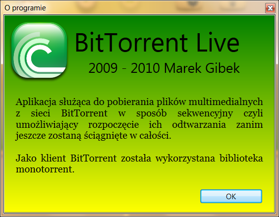
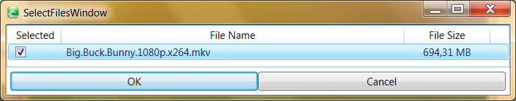
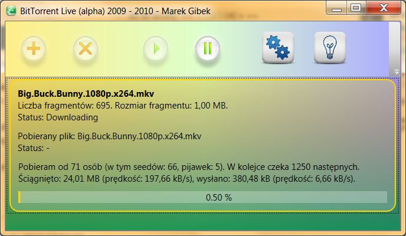
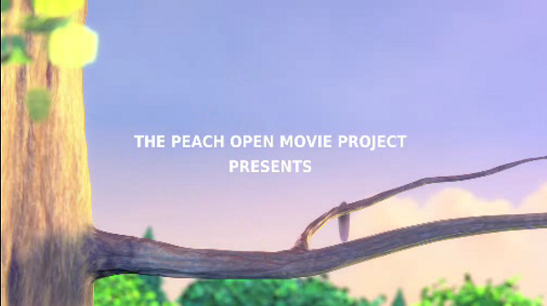

# BitTorrent Live (2010)

BitTorrent Live is an application that allows me to watch movies while I am downloading them. It is BitTorrent client with sequential downloading. It knows the AVI file structure and it downloads bits in an intelligent way (frame index first and then video and audio frames). After initial buffering (30-60 seconds) you can start watching!

Technology: C# / WPF.

This is a private project - not publicly available.

## Screenshots

