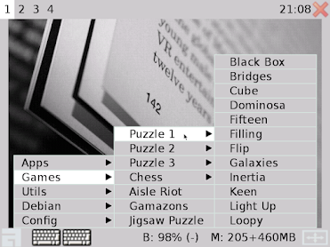
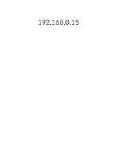
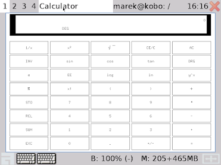
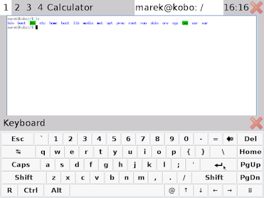
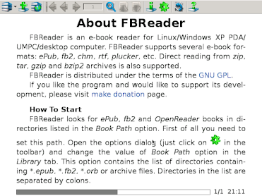
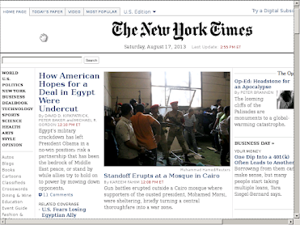

# Kobo as a Linux tablet (2013-08)

I've successfully installed Debian Jessie (and previously Ubuntu 13.04) on my Kobo Touch e-book reader. Almost all apps are running (games, utils, etc). To do it I needed to:

- repartition original SD card (I replaced it with bigger one)
- make following changes in kernel's source code:
  - for eInk driver - enable autoupdate (MMU is used to detect which part of the screen have changed and needs update)
  - for keyboard driver - add sync events to make it compatible with x11
  - for touch driver - it was optional but I upgraded driver to be multitouch driver (kobo is single touch device only because of the software limitation - hardware supports two fingers, so gestures like pinch zoom will be possible!)
- write boot screen selector
- install linux distribution in chroot environment
- configure X11 for touch, add virtual keyboard, configure easy to use with kobo window manager (awesome)

## Download

Sample image can be downloaded from here:

https://www.dropbox.com/sh/snsdg1c5cg21kws/3LfelXgbGe

The image can be used by developers to make new software. Besides GNU G++ it contains:

- mono 3.2.1 with qyoto (you can use Visual Studio and write apps for .NET 4.5 + QT4.8)
- python 3 with pyside (you can write QT apps with python)

## Installation

1. Get empty SD card (8GB or more).
2. Download and extract image file. Flash it to SD card with Win32DiskImager (Windows) or dd (Unix).
3. Open the back cover of the Kobo. Replace original SD card with new one.

> Warning! This image was tested only with Kobo Touch model N905C. Probably it will NOT WORK with OTHER devices. By installing it you will erase all data on your SD card. Make sure you have a copy. WHATEVER YOU DO, YOU DO AT YOUR OWN RISK!

Linux account login/password: `marek` / `abc123`.

## Screenshots

    Boot menu:

    Diagnistic mode - after click on the Wi-Fi icon (right bottom corner) - ftp & telnet:

    After click on computer icon - booting continues (click on book icon loads original kobo software):

    Games menu:

    Calculator:

    Fullscreen mode (home button):

    Terminal and keyboard:

    FBReader:

    New York Times in Firefox (fullscreen):

    Aisle Riot - Klondike:

    Jigsaw Puzzle:

    Power off:

## Additional links:

- http://www.mobileread.com/forums/showthread.php?t=220350 - announcement of kernel source code changes
- http://www.mobileread.com/forums/showthread.php?t=222123 - announcement of sample image
- http://www.mobileread.com/forums/showpost.php?p=2695194&postcount=139 - first working Android image for Kobo Touch
- http://www.mobileread.com/forums/showthread.php?t=244000 - second version of Android image for Kobo Touch and Kobo Glo
