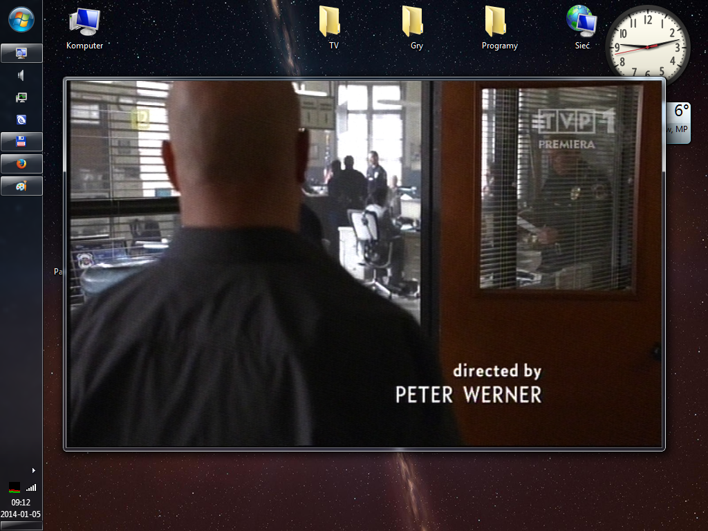
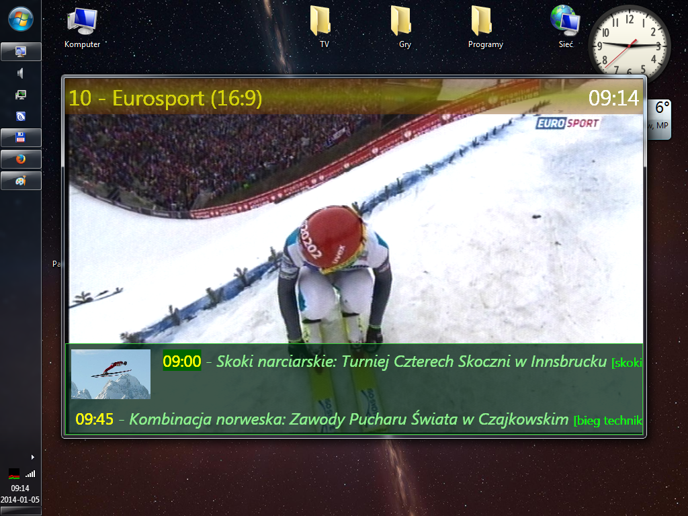

# Marek TV (1999 - 2015)

Marek TV is an application to watch analog TV. The history of the program starts around 1997 when I started programming BT848 RISC TV chip. I ended up with fully working device driver (including DMA transfer, software teletext decoder) and optimized real time MJPEG encoder (I rewrote JPEG's IDCT - inverse discrete cosine transform for AMD's 3D now SIMD instruction set). The latest version uses Direct Show to support all the codecs and all the hardware (it is a great benefit but it was much less fun to code comparing to the first version where I had to program everything).

Technology: C++ / C# / WPF / DirectShow / assembler (SIMD optimizations).

This is a private project - not publicly available.

Features:

- supports any TV tuner (through Direct Show)
- video recorder (AVI, h264 encoding)
- TV listings
- teletext
- no CPU usage on PCI cards (DMA transfer)
- software decoder for Nagravision 1 scrambling system (video & sound, obsolete)
- video backup system (tv output required, obsolete)

## Screenshots

