# Terminator (2006-2013)

Terminator is an Automated Trading Software. It is designed to work on Polish stock market especially with futures contracts.

Features:

- ability to execute orders on real market (two providers are implemented: BDM SA and BOŚSA)
- fast simulation module (20 000 candles / thread)
- very optimized, hardware accelerated charts
- ultra-fast memory mapped database files
- complex reports
- system optimizer
- integrated www server
- self-optimizing systems in progress (!!)

Technology: C# / WPF / C++ / DirectX

This is a private project - not publicly available.

## Screenshots

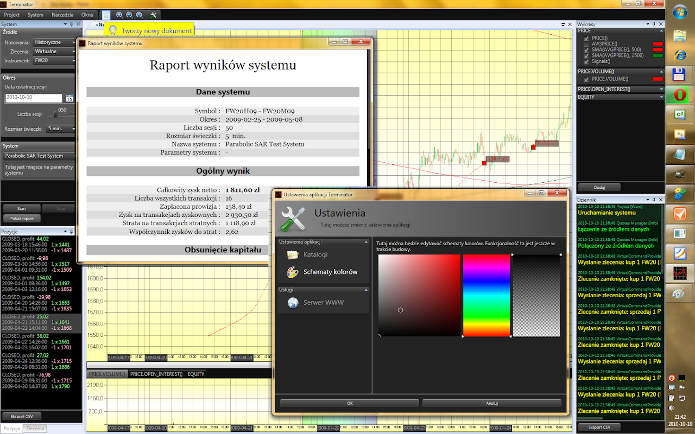

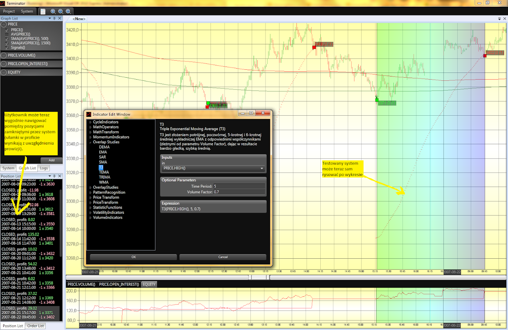

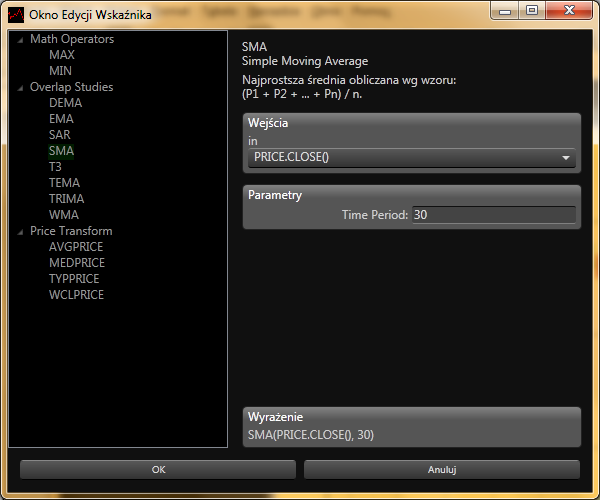

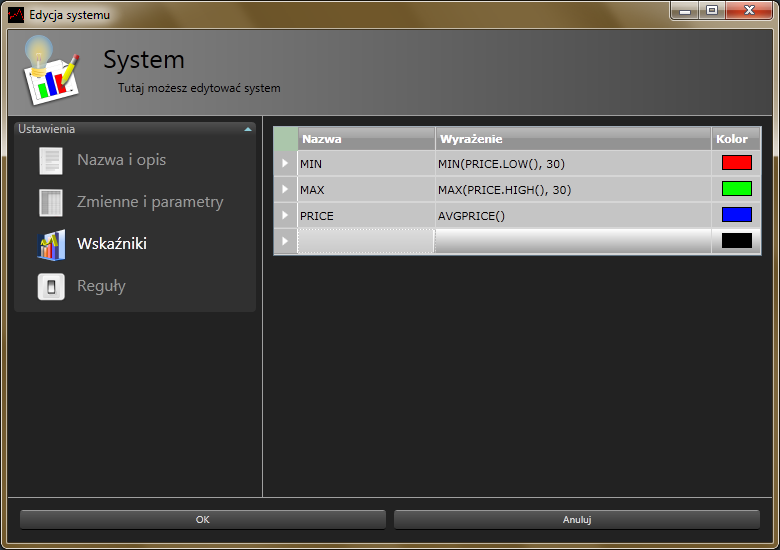

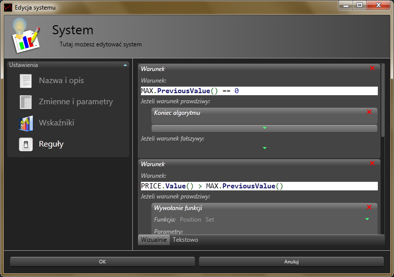

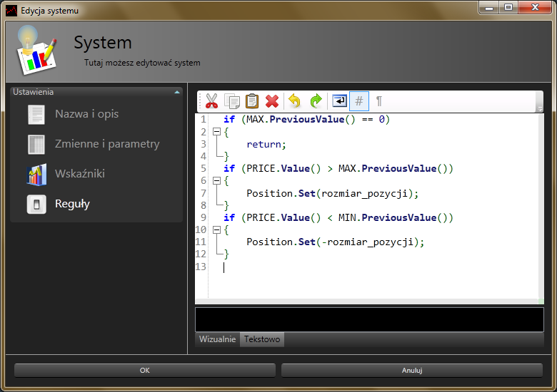

## Older version (2006-2009, C++)

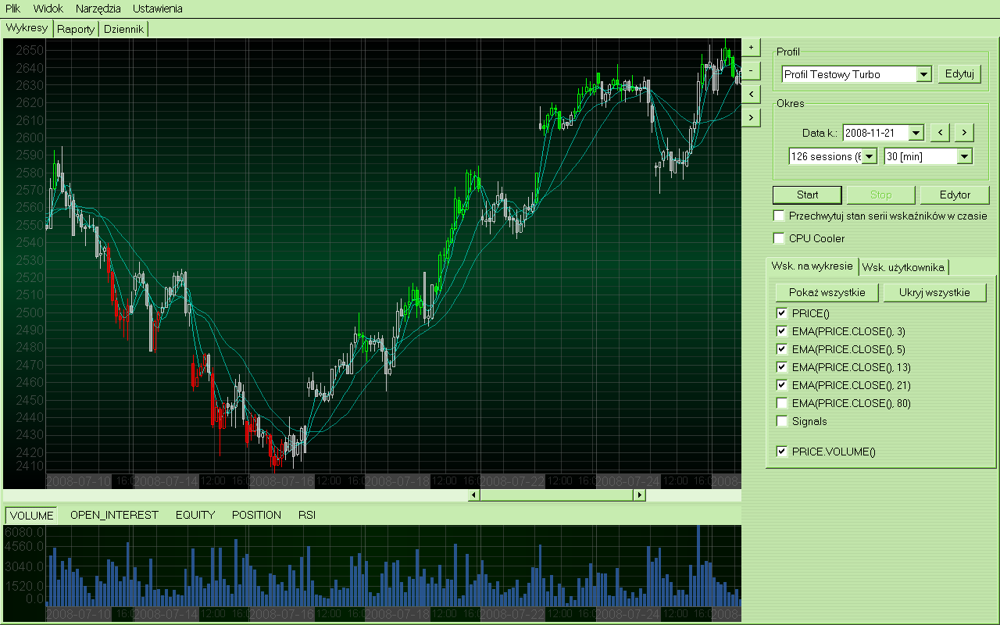

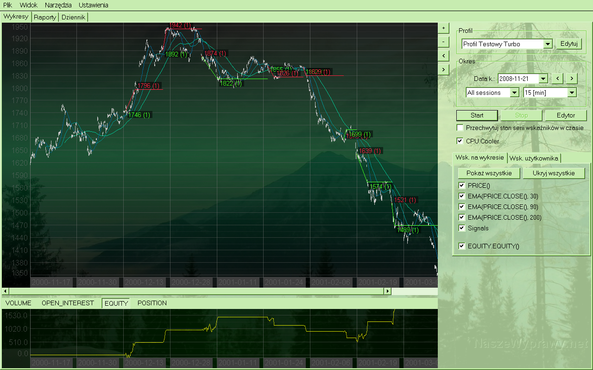

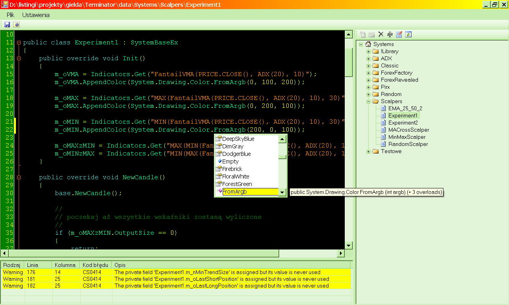

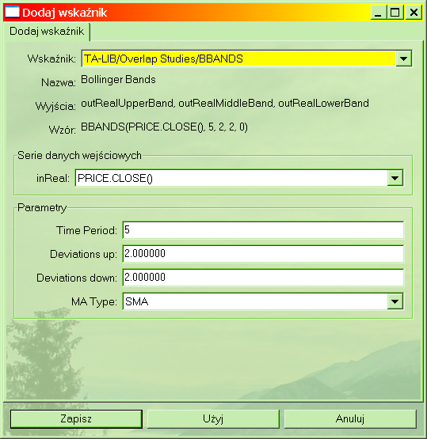

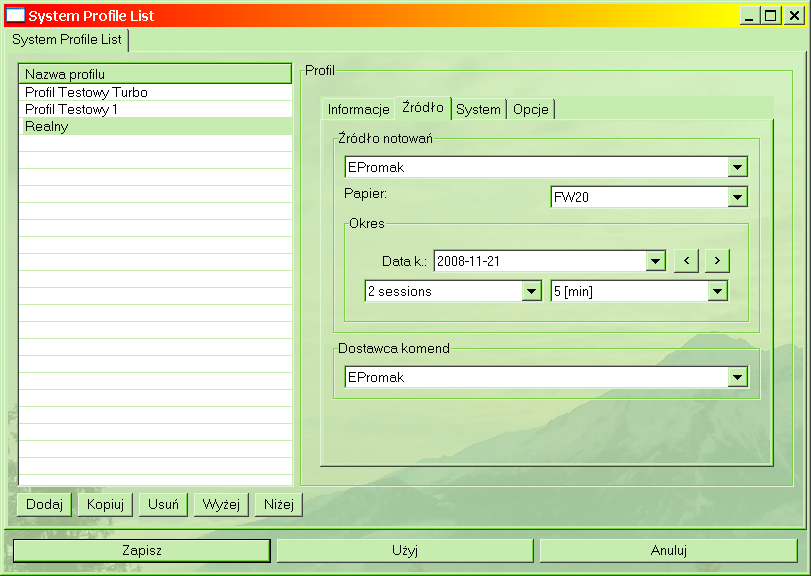

### WWW interface (monitor)

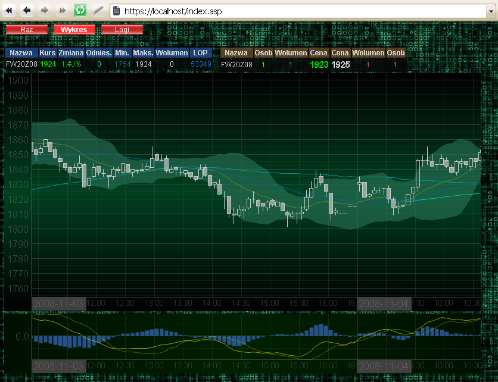

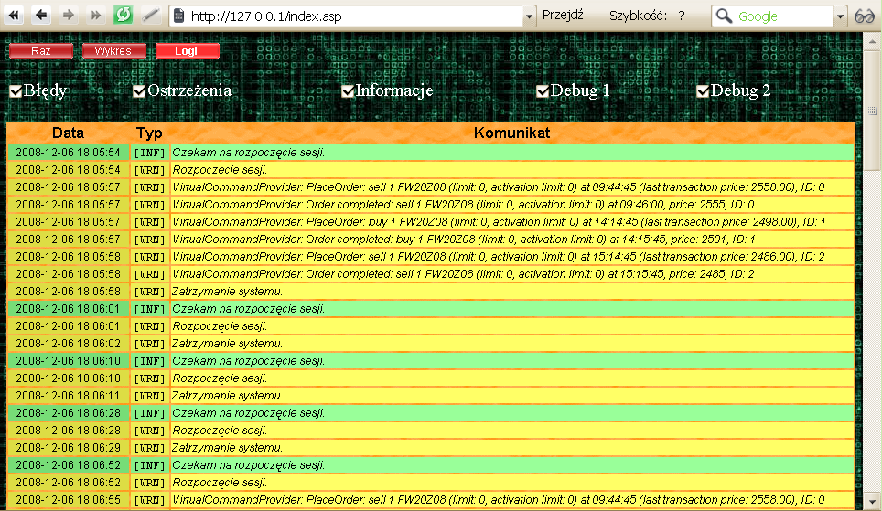
