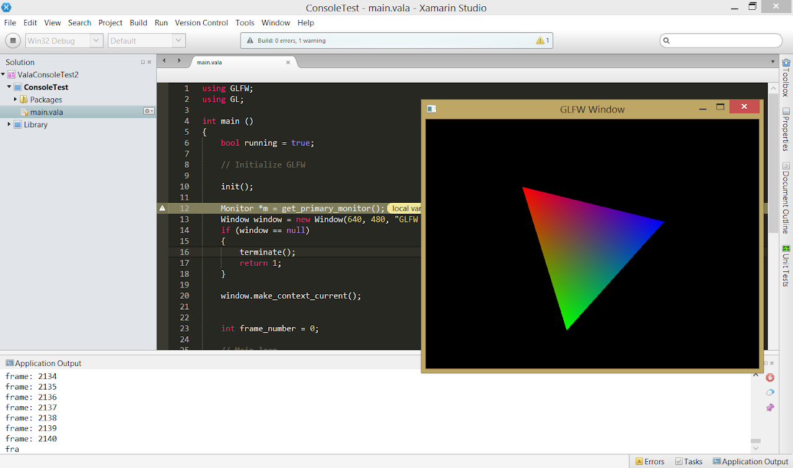

I took Vala Binding Mono Develop plugin (it's development was abandoned a few years ago) and I upgraded it to Mono Develop 5. I've rewritten the references (packages) mechanism and prepared portable version for Windows. The same plugin works on Windows & Linux.

There is still code complete feature missing. Code complete was working in the previous version so you can monitor my github page - maybe I'll make it working again.

## Features

- support for Vala projects
- references to local projects and to external packages
- debugger is working (now also on Windows through my Windows version of MonoDevelop.Debugger.Gdb.Windows plugin)
- simple syntax highlighting

## Missing features

- code completion (works behind, no UI yet)
- smart editor
- refactoring tools

## Future

I do not develop it longer. I started creating Vala plugin for IntelliJ, which is much better IDE. Unfortunately, this is not an open source project at this moment.

## Installation

Version 5.0 works with MonoDevelop 5.0 and 5.1 and was tested on Windows with Xamarin Studio 5.1.4.

Version 5.4 works with MonoDevelop 5.4 and was tested on Linux.

To install, copy ValaBinding.dll to monodevelop/AddIns/ValaBinding folder (/usr/lib/monodevelop/AddIns/ValaBinding on Linux).

For Windows, you may want to try my portable package (includes MonoDevelop 5.1.4, valac 0.25.1 and mingw64 4.9.1).

## Source code

The project is located on the git-hub: https://github.com/marek-g/ValaBinding

## Binaries

Portable version (MonoDevelop 5.1.4, vala 0.25.1, mingw64 4.9.1) can be downloaded from here:

https://www.dropbox.com/s/l9p6hkpxsjkyxci/Vala_workspace_2014-07-30.zip
