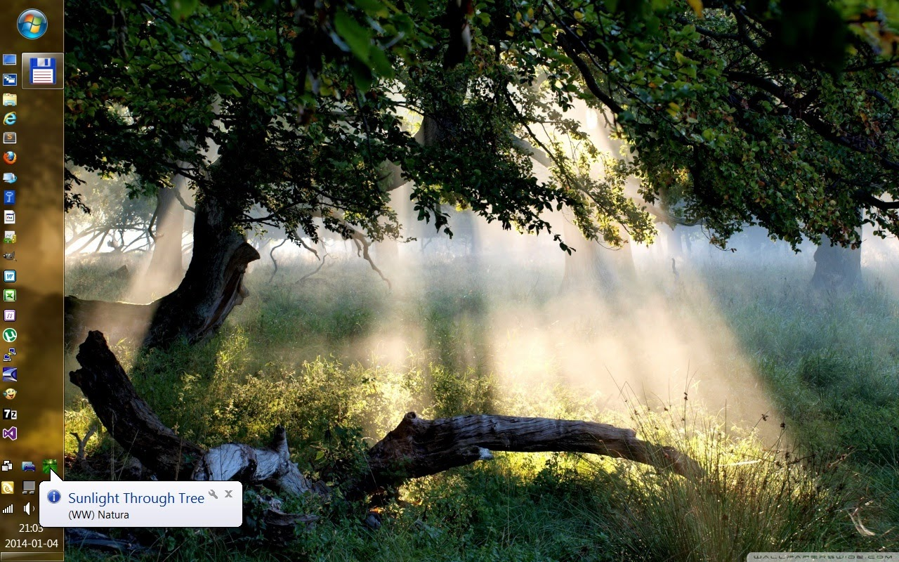
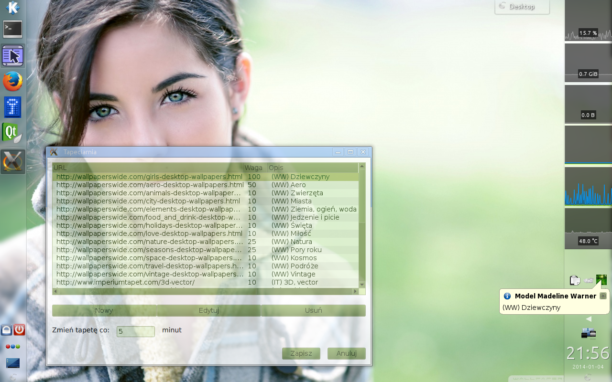

# Tapeciarnia (2012 - 2014)

Tapeciarnia is a small application created to change desktop wallpaper to random one downloaded directly from the internet. You don't have to download any gallery to your drive in advance.

Features:

- extensible data sources (currently wallpaperswide.com, www.imperiumtapet.com, www.tapeciarnia.pl, tapety.tja.pl)
- flexible configuration (you can define your own categories by adding sublinks to wallpaper sites)
- ability to change category weights
- fast (written in C++)
- works on Windows and Linux (uses Qt/QML)

Tapeciarnia running on Windows:

Tapeciarnia running on Linux:

Source code:

https://github.com/marek-g/Tapeciarnia
